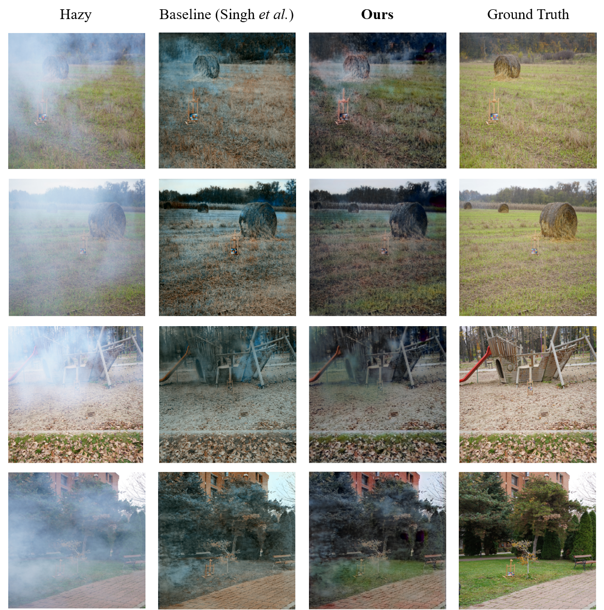

# Generative Adversarial Networks for Single Image Dehazing

## COMP4471 Course Project
KIM, Jaehyeok (20550178)&nbsp;&nbsp;&nbsp;&nbsp;KIM, Hyeonjae (20543852)

## Abstract
Single image dehazing is a challenging task which is critical for success in downstream computer vision tasks. Recently, generative adversarial networks (GANs) have achieved significant advancement in single image dehazing and received great attention in research. However, a great number of existing learning-based dehazing models are still not fully end-to-end, following the conventional dehazing methods. Yet, due to the ill-posed natures of the problem, it is intricate to accurately estimate intermediate parameters in the conventional methods. On top of that, most existing methods train the model only on synthetic hazy images, thereby making the model hard to generalize well on real hazy images. To address this problem, we propose a novel GAN-based end-to-end model that incorporates the strength of two prior GAN-based works. Our model shows satisfactory performance even with the limited amount of high-quality real-world hazy images. At the same time, our model is able to generate more authentic and natural dehazed images with lessened color distortion and fewer artifacts. Experimental results on real-world images show that our model shows comparable performance with the state-of-the-art dehazing algorithms and improved qualitative aspects in terms of color casting and color constancy.

## Qualitative Results

## Links to base models
The implementation of our project is based on the BPPNet and the implementation of the fusion discriminator is adopted from FD-GAN
- BPPNet: https://github.com/ayu-22/BPPNet-Back-Projected-Pyramid-Network
- FD-GAN: https://github.com/WeilanAnnn/FD-GAN
